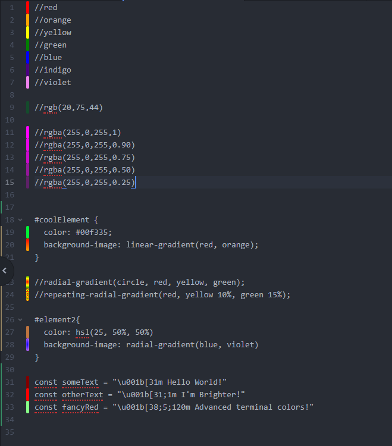

# The Chromo Package

Chromo makes working with colors easier by adding color previews to the gutter.
This gutter can be toggled on or off. Chromo will pick up color names and codes from
all types of files and text (for this reason it may sometimes pick up colors in places you didn't expect).

More info: [Vertagon Chromo](http://www.vertagon.net/post/chromo.html)

Currently Supported color types
   1. Hex color codes (Ex: #000fff)
   2. RGB color codes (Ex: rgb(0,0,255))
   3. RGBa color codes (Ex: rgba(0,0,255,0.5))
   4. HSL color codes (Ex: hsl(240, 100%, 50%))
   5. HSLa color codes (Ex: hsla(240, 100%, 50%, .5))
   6. CSS color names (Ex: blue, Blue, etc.)
   7. 8 ansi escape code colors (Ex: \u001b[34m)
   8. 16 ansi escape code colors (Ex: \u001b[34;1m)
   9. 255 ansi escape code colors (Ex: \u001b[38;5;4m)
   10. linear gradients (Ex: linear-gradient(green, blue))
   11. radial gradients (Ex: radial-gradient(yellow, green, blue))

The current build is early and thus is limited in features and may contain bugs.
Look for future updates that will add more features and flatten out those bugs
and performance issues.

## Future Features

In the future we hope to support the following features:
   - Option to style text with color preview
   - Multiple colors per line in gutter
   - color constants and variables
   - color values with expressions
   - Color previews on code suggestions
   - foreground vs background vs text differentiation
   - Previews for "currentcolor" css option
   - Color pickers!
   - Custom color definitions
   - Much, Much more
