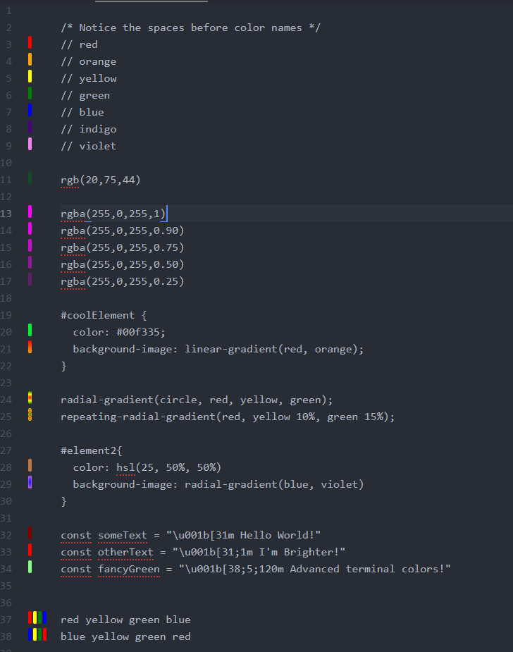

# The Chromo Package

Chromo makes working with colors easier by adding color previews to the gutter.
This gutter can be toggled on or off. Chromo will pick up color names and codes from
all types of files and text (for this reason it may sometimes pick up colors in places you didn't expect).

More info: [Vertagon Chromo](http://www.vertagon.net/post/chromo.html)

Currently Supported color types
   1. Hex color codes (Ex: `#000fff`)
   2. RGB color codes (Ex: `rgb(0,0,255)`)
   3. RGBa color codes (Ex: `rgba(0,0,255,0.5)`)
   4. HSL color codes (Ex: `hsl(240, 100%, 50%)`)
   5. HSLa color codes (Ex: `hsla(240, 100%, 50%, .5)`)
   6. CSS color names (Ex: `blue`, `Blue`, etc.)
   7. 8 ansi escape code colors (Ex: `\u001b[34m`, `\e[01;34m`, etc.)
   8. 16 ansi escape code colors (Ex: `\u001b[34;1m`)
   9. 255 ansi escape code colors (Ex: `\u001b[38;5;4m`)
   10. linear gradients (Ex: `linear-gradient(green, blue)`)
   11. radial gradients (Ex: `radial-gradient(yellow, green, blue)`)

## Multi-Preview Lines

By default, each line can display up to 10 previews at a time (can be configured
to allow more). The gutter will expand to accomodate more preview pills. These previews
will be displayed in the same order that they appear in the text.

## Composite Previews

Some color/gradient types have the potential to contain other colors within them
such as gradients that use hex codes to identify their colors. By default, these
"composite" color codes that make up a larger color code will NOT be displayed as
previews, but this can be turned on in the settings via the "Show Composite Colors"
option.

## Color Highlighting

Hovering over a preview pill with your mouse will highlight its respective code
in the document. By default, the text will be highlighted with the color it represents.
This behavior can be modified in the settings to alternatively use the default
neutral highlight color of the text editor or to be turned off all together.

## A Note About ANSI Colors

Chromo attempts to identify common ANSI escape code colors for
shells. It is important to note that not all shells/terminals
implement colors in the same ways or at all. Additionally, the
potential for wildcards and special cases makes it difficult to
fully predict how an escape code color will look on any platform. For these reasons, please understand that the previews for ANSI colors are only hints and do not necessarily reflect the exact look on any shell. Chromo uses a set of Xterm defined colors as a baseline.
